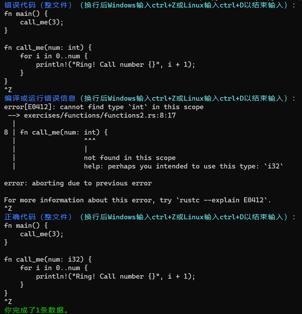

# 针对开发过程的错误收集
开发者在学习、编写Rust程序时常会遇到编译错误。需要收集在完成Rust习题、实际Rust开发时遇到的编译错误。

对于做练习出现的每次错误，一条数据包括：
 * 包含错误的**整个文件**内容
 * 编译或运行报错信息
 * 修改正确后的**整个文件**内容

对于开发时出现的每次错误，一条数据包括：
 * 出现错误的**函数及其依赖的函数**内容
    * 例：若A函数内调用B函数时出错，则记录内容为：B函数+A函数
 * 编译或运行报错信息
 * 修改正确后的**函数体及其依赖函数的函数体**内容

## 标注方式
为方便大家标注，已准备好一个Python脚本`develop/script.py`，运行该脚本即可标注数据。

在`develop`目录下运行`python script.py --output_path data.jsonl`以运行脚本，根据提示将对应数据复制到控制台。代码与报错信息为多行输入，故在粘贴后需要*换行再输入ctrl+Z（Windows）或ctrl+D（Linux）*表示输入完成。

标注示例：

数据记录在`develop/data.jsonl`。

## 数量目标
对于出现编译错误的练习题，每道题记录至少2次编译错误。标记至少100道题。

对于实际Rust开发（如rcore lab），记录至少30次编译错误。