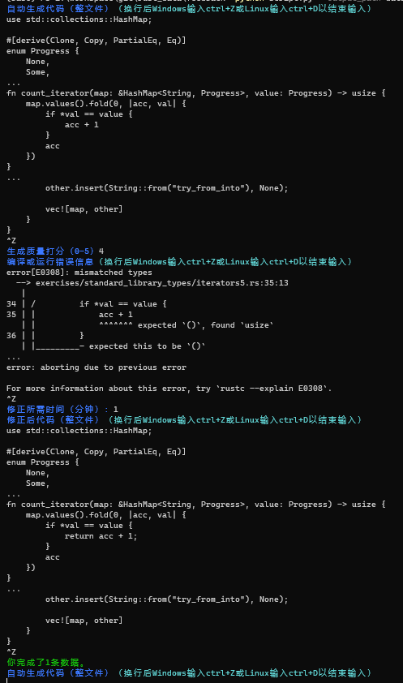

# 针对插件输出的反馈收集
通过收集用户对CodeGeeX生成Rust代码的反馈数据，可以进一步改善模型，使插件生成更符合开发者意图的代码。

对于插件在练习题中出现的每次错误，一条数据包括：
 * 含有插件生成错误代码的**整个文件**内容
 * 对生成内容的主观评价（0-5分，越高代表质量越好）
 * 编译或运行报错信息
 * 将生成内容修改为正确代码所需时间（以分钟为单位）
 * 修改正确后的**整个文件**内容

## 标注方式
为方便大家标注，已准备好一个Python脚本`feedback/script.py`，运行该脚本即可标注数据。

在`feedback`目录下运行`python script.py --output_path data.jsonl`以运行脚本，根据提示将对应数据复制到控制台。代码与报错信息为多行输入，故在粘贴后需要*换行再输入ctrl+Z（Windows）或ctrl+D（Linux）*表示输入完成。

标注示例：

数据记录在`feedback/data.jsonl`。

## 数量目标
每人标记至少100道题，每道题目至少生成5次。