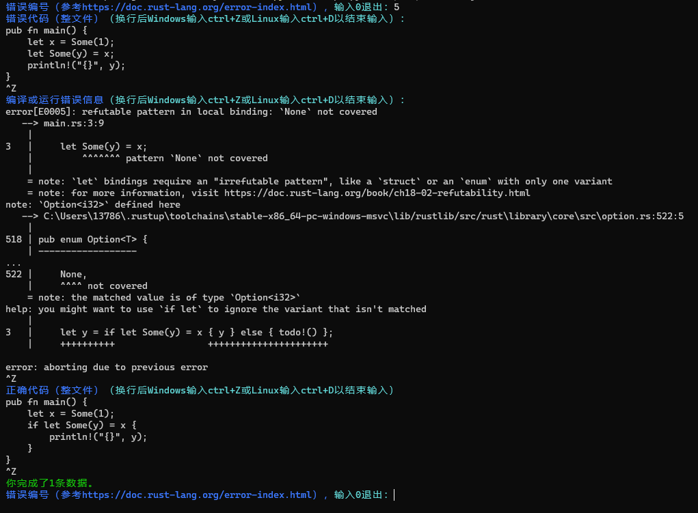

# 针对错误类型的数据收集
[Rust Compiler Error Index](https://doc.rust-lang.org/error-index.html)共包含508个Rust编译器会报出的错误，其中部分错误可以无需额外信息，仅根据错误代码内容即修复。需要将这些错误类型筛选出来，并围绕其构造错误代码与正确实现的数据。

首先，用两天时间从Index中筛选出无需额外信息即可修复的错误类型。为不同标注者分配不同的错误类型。

对于某种错误类型，构造出现对应错误的代码与相应的正确代码。可以参考已有的Rust代码进行构造，比如基于rustlings, rcore, Linux syscall等。

每条数据包含：
* 该错误类型在Index中的编号，范围为1-790
* 包含错误的代码。若从题目中构造，则为整个题目文件；若从rcore, Linux等Rust项目构造，则为构造错误所在的单文件
* 编译或运行报错信息。若从rcore, Linux等Rust项目构造，则为在项目中编译或运行的报错信息
* 正确代码，从第二项“包含错误的代码”修改而来

## 标注方式
为方便大家标注，已准备好一个Python脚本`synthesize/script.py`，运行该脚本即可标注数据。

在`synthesize`目录下运行`python script.py --output_path data.jsonl`以运行脚本，根据提示将对应数据复制到控制台。代码与报错信息为多行输入，故在粘贴后需要*换行再输入ctrl+Z（Windows）或ctrl+D（Linux）*表示输入完成。

标注示例：

## 数量目标
对于每个错误，构造至少20条数据。